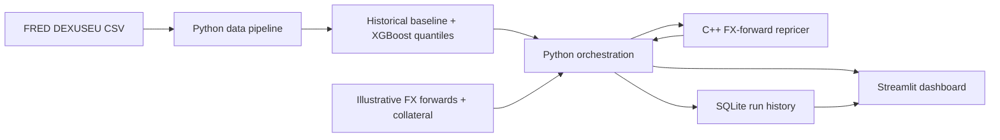

# Architecture and data flow

This is the V1 component map. Read it alongside the source files.

## Component responsibilities

| Likely file | One responsibility | What to inspect |
| --- | --- | --- |
| `data/DEXUSEU.csv` | Dated source FX rates. | Latest rate, missing entries, date range, and FRED source citation. |
| `src/data_pipeline.py` | Clean rates; create past-only features and 10-observation future target; split by time. | Sorting, missing-value treatment, purge logic, leakage checks. |
| `src/model.py` | Train/evaluate XGBoost quantiles and historical baseline; score latest features. | Objective, hyperparameters, seed, evaluation metrics, artifact/version handling. |
| `src/risk_engine.cpp` | Reprice an FX forward for supplied spot, elapsed days, and currency rates; aggregate by netting set and subtract received USD collateral. | Sign convention, ACT/365 and discounting, numeric validation, grouping boundaries, output format. |
| `src/engine.py` | Call the compiled C++ program from Python. | Input validation, error handling, executable path, response parsing. |
| `src/storage.py` | Save run details in SQLite. | Schema, parameterized SQL, timestamps, model/data identity. |
| `run_pipeline.py` | Coordinate market forecast, scenarios, pricing, and persistence. | Which values come from the model versus illustrative shocks; run ordering and +14 calendar-day forecast valuation convention. |
| `app.py` | Browser interface. | Labels, units, model caveats, user input limits, display of comparative metrics. |
| `tests/` | Check pricing and time-leakage boundaries. | Financial invariants and known-label timing, not just happy-path snapshots. |

## Key data definitions

| Name | Unit | Meaning |
| --- | --- | --- |
| `date` | Calendar date | Published market observation date. Dates with no usable observation do not count toward the 10-observation horizon. |
| `spot` or `S` | USD per EUR | DEXUSEU FX level. Must be positive. |
| `return_10` | Log return | `ln(S[t]/S[t−10])`, a past-looking XGBoost feature. |
| `future_log_return` | Log return | `ln(S[t+10]/S[t])`, the XGBoost training target. |
| `q05`, `q95` | Log return | Conditional lower/upper forecast for the next 10 published observations. |
| Scenario spot | USD per EUR | Model boundary: `S_today × exp(predicted_log_return)`; illustrative ±15% stress: `S_today × (1 ± 0.15)`. |
| `signed_eur_notional` | EUR | Signed EUR amount the bank receives; negative means the bank pays EUR. |
| `strike` | USD per EUR | Contracted conversion rate for the illustrative FX forward. |
| `mtm_usd` | USD | `signed_eur_notional × [scenario_spot × exp(−eur_rate × tau) − strike × exp(−usd_rate × tau)]`; `tau` is remaining calendar days divided by 365. |
| `collateral_usd` | USD | Cash collateral assumed received for the matching demo netting set. |
| `exposure_usd` | USD | `max(sum of set MTMs − collateral, 0)`. |

## One end-to-end example of data movement

1. Read and clean DEXUSEU; take the last usable rate as `S_today`.
2. Build a feature row using only rates published by that date.
3. Predict the lower and upper 10-observation log returns.
4. Convert each return into a scenario spot rate.
5. Send the scenario spot, illustrative trades, USD/EUR rates, and elapsed calendar days to the C++ CLI. The pipeline uses 0 elapsed days at observed spot and 14 at the forecast/stress spots.
6. Receive per-netting-set values and resulting exposure from the C++ CLI. Individual trade values are calculated internally but are not output separately by that CLI.
7. Save the run in SQLite with data hash, dates, metrics, scenario exposures, and a current snapshot of sample inputs. The dashboard reads saved model files and uses the C++ engine for interactive sensitivities.

## Trust boundaries and failure handling

The pipeline and engine reject missing or non-positive spot rates, invalid trade strikes, malformed numbers, unknown netting-set IDs, and negative received collateral. A failed C++ call should produce a visible error rather than a stale previous result. Saved scenarios distinguish forecast boundaries from the pipeline's illustrative stresses; manual slider changes are not saved as database runs.

## Scope of V1

This is a focused single-factor teaching project: one public USD/EUR historical series, simplified forward valuation with one constant discount rate per currency, static collateral, and illustrative trades. It demonstrates a coherent model lifecycle, but it does not implement legal netting review, market yield curves, full market-risk simulation, margin period of risk, default modeling, or regulatory exposure calculations.

SQLite keeps prior model-run and scenario rows, but the trade/netting-set tables are current snapshots and the `models/` JSON files are replaced when the pipeline is rerun. A V2 audit design would version and retain complete input portfolios, model binaries, configuration, and environment for each run.
